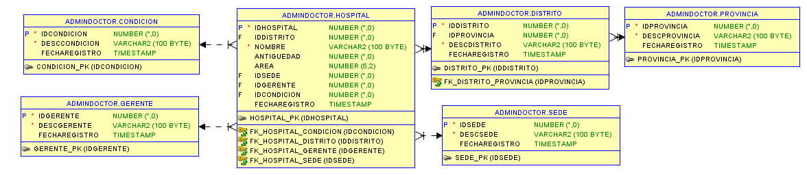

# Proyecto de Gestión de Hospitales en Oracle PL/SQL

Este proyecto consiste en la creación y gestión de una base de datos para hospitales, utilizando Oracle PL/SQL. Incluye la creación de tablas, procedimientos almacenados dentro de un paquete y scripts para insertar, actualizar, eliminar, listar datos y buscar hospital.

## Estructura del Proyecto

```
│── create_user_adminDoctor.sql          # Script para crear usuario admindoctor
│── grant_permissions_adminDoctor.sql    # Script para dar permisos al usuario
│── create_tables_BD_hospital.sql        # Script para crear tablas
│── pkg_hospital.sql                     # Script para crear procemientos en un paquete
│── insert_datos.sql                     # Script insetar datos en las tablas
└── README.md                            # Descripción del proyecto
```

## Requisitos
- Oracle SQL Developer
- Oracle Database 21c o superior

## Instrucciones de Uso

### 1. Crear Usuario Administrador  

Ejecuta el siguiente script para crear el usuario `admindoctor`:  

```sql
@scripts/create_user_adminDoctor.sql
```

### 2. Asignar Permisos al Usuario  

Otorga los permisos necesarios al usuario `admindoctor`:  

```sql
@scripts/grant_permissions_adminDoctor.sql
```

### 3. Crear Tablas  

Ejecuta el script para crear las tablas de la base de datos del hospital:  

```sql
@scripts/create_tables_BD_hospital.sql
```
  
### 4. Crear el Paquete PL/SQL  

Define los procedimientos almacenados dentro de un paquete ejecutando el siguiente script:  

```sql
@scripts/pkg_hospital.sql
```

### 5. Insertar Datos de Prueba  

Pobla las tablas con datos de prueba utilizando los procedimientos creados en el paquete:  

```sql
@scripts/insert_datos.sql
```

### 6. Finalización  

Después de ejecutar todos los scripts, la base de datos estará lista para su uso.  

## Contacto
Para dudas o sugerencias, puedes abrir un issue o contactarme directamente.

¡Gracias por utilizar este proyecto! 🚀

